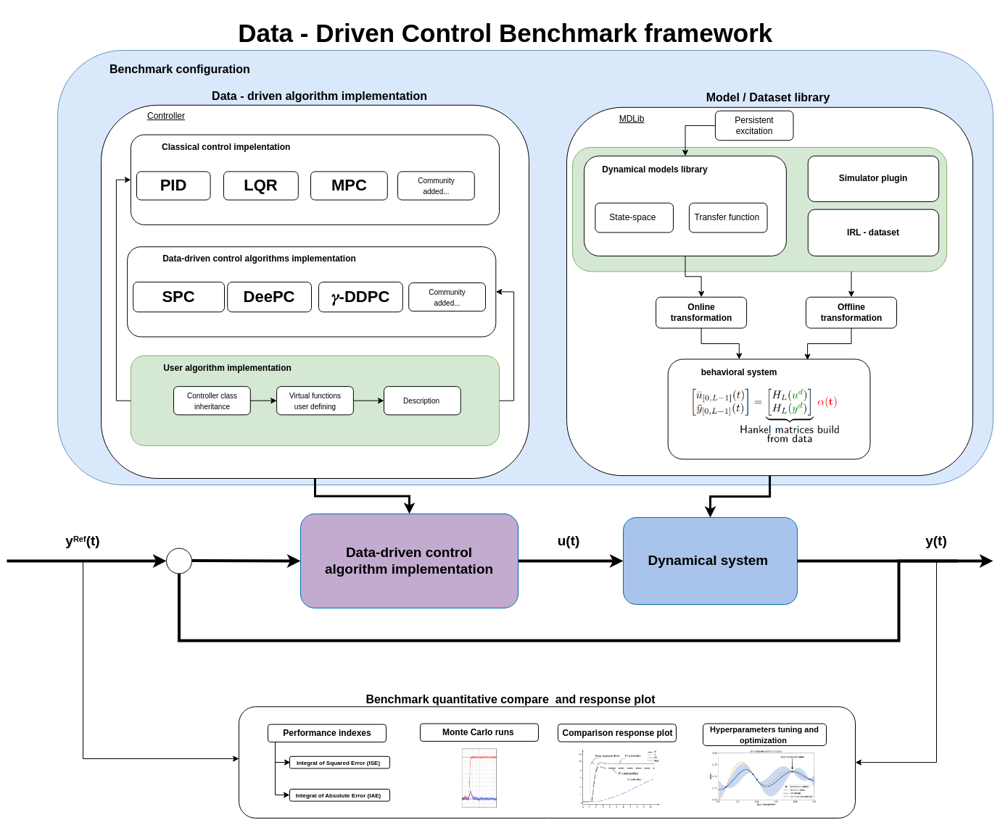

# csbenchlab
Benchmarking toolbox for evaluation, tuning and comparison of arbitrary controllers while controlling arbitrary dynamical systems.
Primarly developed in Matlab and Simulink, csbenchlab offers tools for making control system component [plugins](doc/Concepts.md)
and seamless plugin integration with the rest of the toolbox features.

## Language support
- Matlab
- Simulink
- Python

## Dependencies
- Matlab 2022b or newer
- Simulink coder

## Examples
[Examples](doc/Examples.md)

